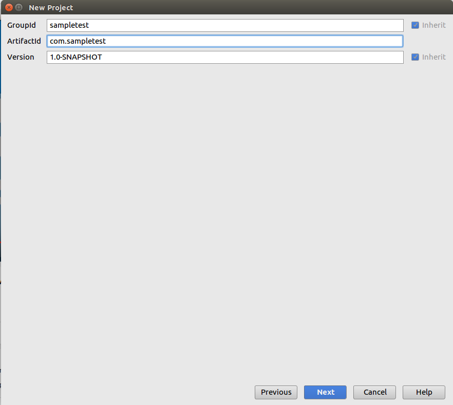

# appium-automation-testing
Understanding Appium

## Note - I do not claim that this is my original work. This is just a compilation of the open source available information and tried to make it easier to understand and implement.


### What is Appium? and Why to use?
* Appium is an open-source tool for automation testing for mobile applications. 
* Appium can be used to test native, hybrid and mobile web applications on both Android and iOS platforms. 
* It is a cross-platform tool which allows to write test againts multiple platforms using the same API. 
* This reduces the efforts to rewrite code for different platforms and the same code can be reused for all the platforms.
* Appium allows to choose the language to write the tests.
* Appium supports automation tests on Physical devices and Emulator/Simulator.

#### Write tests in any language like Java, Ruby, Python, PHP etc. as per your convenience and use them to automate Android and iOS, isn't that sound cool !!

### Installation Requirements :
    Prerequisites or tools needed to complete the Appium installation.
    1. Install JDK (prefer the latest one)
    2. Get and install any IDE of your choice (Eclipse, IntelliJ IDEA, etc.)
    3. Android SDK
    4. Install Appium
      
Links to download the above tools / softwares - 
1. JDK - http://www.oracle.com/technetwork/java/javase/downloads/jdk8-downloads-2133151.html (choose your OS and the latest version of JDK to install)

2. IntelliJ IDEA - http://www.jetbrains.com/idea/download/#section=linux (Choose your OS)

3. Android SDK - https://developer.android.com/studio/index.html (Scroll to bottom and choose to download the sdk with respect to OS)

##### Assuming the first 3 required installations are already done. As we are learning for Appium, lets start with installing Appium

### Installing Appium

If you are using a Mac or Windows machine then you are fortunate enough to enjoy the ready to install desktop apps. 

    Visit this link to download the apps - https://github.com/appium/appium-desktop/releases/tag/v1.0.0
    (Please download .dmg file for mac users and .exe file for Windows)

But if you are using Ubuntu or learn to hack using terminal on Windows and Mac also. So, lets get started.

    Visit this link for help - http://appium.io/

To begin we need to install brew and npm (Node package manager, an online repository for publising open source Node.js projects) first.
Open the terminal and type the following commands one by one. 
Remember these are the installation commands for these softwares so please wait for them to finish with the installation. It depends on your internet speed.

    1. brew install node            # get node.js
    2. npm install -g appium        # get appium
    3. npm install wd               # get appium client
    4. appium &                     # start appium

This is how terminal looks when appium is started.


Cheers!!   We are done with the appium installation.

##### We are done with the basic installations, now we need to setup the tools to make them ready to be used by Appium. 

Now, open SDK Manager. (Can be opened directly on Mac and Windows) 
Let's say your sdk is installed in home -> ankit -> android-sdk-linux (please assume this throughout the tutorial). 
Open terminal and move to android sdk folder using commands:

    cd ankit
    cd android-sdk-linux
    cd tools
    ./android

This opens up the Android SDK Manager. 
We need to make sure that we have installed the following -  
1. Android SDK Tools
2. Android SDK Platform Tools
3. Android SDK Build Tools

Now, lets set the Android Home Environment.

Open terminal and enter the command

    gedit .bashrc 

This opens the bashrc file to configure the android home environment.

Scroll to the bottom and enter your paths in this way and save the file 

    export ANDROID_HOME=/home/ankit/android-sdk-linux
    export PATH=$PATH:/home/ankit/android-sdk-linux/tools
    export PATH=$PATH:/home/ankit/android-sdk-linux/platform-tools
    ** Don't forget to change the path **

This is all we need to set up the Appium. We are ready to start with the Automation Process. 

## Automation Using Appium

We have a tool UI Automator Viewer which is helpful to inspect the application's UI.

Uses of the UIAutomatorviewer : 

    1. Easy to inspect the UI elements of the screen in an application.
    2. Click on any element and get its complete information like the element is of which class, id given, the package name etc.
   
There could be many uses but for now we would be using it to get the package name and id of the element.

How to use ? 

    1. Open terminal
    2. Navigate to the tools folder like we did to open SDK manager using (cd ankit/android-sdk-linux/tools)
    3. Now enter-> uiautomatorviewer
    4. For now to inspect on the tool. Open any app on your device and connect to your machine or open it on emulator.

* Terminal command to Open UIAUTOMATORVIEWER


* Default look of UIAUTOMATORVIEWER


* Sample Inspect on the WeatherApp (attached as WeatherApp.apk)


#### Its time to Setup our First Project

* Now, open IDE IntelliJ IDEA.

1. Click Create New Project


2. Choose Maven, select the java version and click Next


3. Enter groupId and artifactId, whatever you wish to enter and click Next



4. Enter project name and choose project location and click Finish


So, the Project has been created. Let's move further.

* We need two jar files to begin with writing our first test case.

1. Selenium Standalone Server: link to download - http://www.seleniumhq.org/download/
2. Java - Clinet: link to download - https://mvnrepository.com/artifact/io.appium/java-client (Download the latest and stable version)

* Once you download these files, we have to add these jar files to our project as dependency to use its classes and methods to write the tests.

* Steps to add jar files:

1. Click File and go to Project Structure
2. Tap on Libraries section and click on "+" button and choose Java.


3. Choose the jar files and click Ok for all the dialogs.


* Now let's write our first test case :)

Have a look at project folder architecture at the left of IDE.
1. Go to src -> test -> java
2. Right click on java folder and select New -> Java Class
3. Enter the desired name of class and click Ok


    Download the WeatherApp.apk from my repository or use your app. Keep it in any directory.
    
    Keep in mind to change the path while writing the path in test case and also to change the package name, ids of elements etc. related to your app.
    
    
* Now, write your test case.


#### You can find the Sample test case for entering text in edittext and clicking on button in the given sample.

Sample code for reference:

```

import io.appium.java_client.AppiumDriver;
import io.appium.java_client.android.AndroidDriver;
import org.junit.After;
import org.junit.Before;
import org.junit.Test;
import org.openqa.selenium.By;
import org.openqa.selenium.remote.CapabilityType;
import org.openqa.selenium.remote.DesiredCapabilities;

import java.io.File;
import java.net.MalformedURLException;
import java.net.URL;

/**
 * Created by ankit on 5/5/17.
 */
public class TestWeatherApp {

    private AppiumDriver driver;

    @Before
    public void setUp() throws MalformedURLException {
        //Building desiring capabilities. These are sent to the appium server to install the app on the particular device
        DesiredCapabilities capabilities = new DesiredCapabilities();
        capabilities.setCapability("deviceName", "Lenovo");  //Device name
        capabilities.setCapability(CapabilityType.PLATFORM, "Android");   //Platform
        capabilities.setCapability("platformVersion", "5.1.1");  // Android version
        File file = new File("/home/ankit/IdeaProjects/testApks", "WeatherApp.apk"); //Apk path (don't forget to change the path)
        capabilities.setCapability("app", file.getAbsolutePath());
        capabilities.setCapability("appPackage", "com.weatherapp"); //package name
        capabilities.setCapability("appActivity", "com.weatherapp.controller.activity.MainActivity"); //appActivity
        driver = new AndroidDriver(new URL("http://127.0.1.1:4723/wd/hub"), capabilities); //initialising the AppiumDriver with host url and capabilities
    }

    @After
    public void tearDown() {
        driver.quit(); //quit the driver, after test completion
    }

    //Write your test here
    @Test
    public void testMethod() throws InterruptedException {
        String appPackageName = "com.weatherapp";
        String concatId = ":id/";
        By editTextSearch = By.id(appPackageName + concatId + "editTextSearchCity");
        By imageViewSearch = By.id(appPackageName + concatId + "imgSearch");
        driver.findElement(editTextSearch).sendKeys("pune"); //enter Pune as string in the edit text
        driver.findElement(imageViewSearch).click(); //click event on search image
        Thread.sleep(5000); //hold for 5 seconds after the button is clicked, this is just to see the result
    }

}

```
Run the test - 

    Select Run menu from the menu and within that select Run option
    Or 
    Right click in the class and select Run following with the class name (Ex. Run 'TestWeatherApp')
    
    
And finally, we have written out first test successfully. 
Cheeers !! 

Hope you like the tutorial.


### References 
I pay my gratitude to the following websites and blogs, helped me to understand and learn Appium.

1. https://www.youtube.com/watch?v=nLZigIv82cA
2. https://nishantverma.gitbooks.io/appium-for-android/appium/why_appium.html

